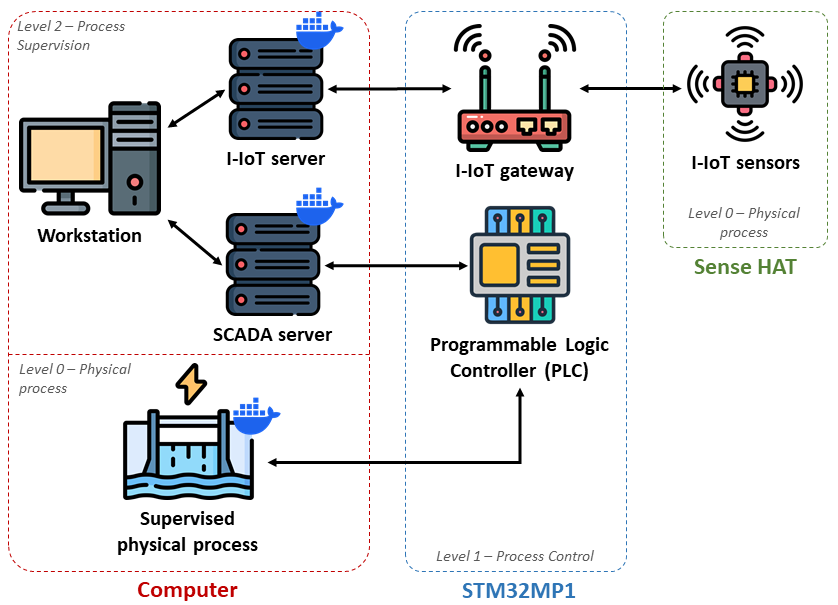

# HENDRICS: A Hardware-in-the-Loop Testbed for Enhanced Intrusion Detection, Response and Recovery of Industrial Control Systems

## Introduction
The HENDRICS testbed is a comprehensive platform designed to emulate an Industrial Control System (ICS). It integrates various software and hardware components, providing a controlled environment for cybersecurity researchers, engineers or students to execute predefined cyberattack scenarios. This platform allows to test, evaluate and enhance detection, defense, and recovery mechanisms against real-world cyber threats.

## Testbed Overview
The HENDRICS testbed emulates the first three levels of the Purdue Model for ICS. The system is composed of both software and hardware elements that work together to recreate an industrial environment. Below are the key components of the testbed:
- **Physical Process Simulation:** a computer system simulates sensors and actuators that drive a hydroelectric power plant process.
- **Industrial Devices:** two industrial device abstractions, a Programmable Logic Controller (PLC) and an Industrial Internet of Things (I-IoT) gateway, are implemented on a STM32MP1 board. These devices emulate the functions of real embedded systems in a Hardware-in-the-Loop manner. The PLC handles the logical control mechanisms regulating the emulated industrial process, while the I-IoT gateway transmits data from the Raspberry Pi Sense HAT to an I-IoT server.
- **Human-Machine Interfaces (HMIs):** web-based HMIs function as SCADA and I-IoT supervisors, providing real-time monitoring of the operational status of the industrial process and connected sensors.
- **Attacks:** the testbed includes 14 implemented attacks, each based on techniques from the [MITRE ATT&CK for ICS Matrix](https://attack.mitre.org/versions/v17/matrices/ics/). These attacks are designed to emulate realistic adversary behavior for cybersecurity testing and research purposes.

> [!NOTE]
> You are not limited to the provided hydroelectric power plant simulation. Any physical process, including a real-world system, can be used as long as it can communicate with the PLC using the Modbus TCP protocol. To use your own process, simply launch your physical system and [reconfigure the PLC](./embedded-device/README.md#openplc-configuration) accordingly. This includes updating the PLC program and adjusting the slave device settings to match your setup. You may also replace or modify the [SCADA system](./servers/README.md#physical-process-simulation-and-scada-system-setup). Just make sure it is configured to communicate with the PLC via port 502 using the Modbus TCP protocol and that it is set to read and write to the correct Modbus addresses defined in your PLC logic.

## Hardware Requirements
To set up the HENDRICS testbed, the following hardware is required:
- A computer running Linux (64-bit)
- A STM32MP157F-DK2 board paired with a Sense HAT add-on board
- A network switch and Ethernet cables

> [!NOTE]
> The testbed was developed and tested on Ubuntu 22.04 (64-bit) for computer's side.

## Installation
The installation process is divided into two independent parts:
- **Embedded Device Installation:** set up the STM32MP1 board by following the [Embedded device installation guide](./embedded-device/README.md)
- **Servers Installation:** after completing the STM32MP1 setup, install the server components by following the [Servers installation guide](./servers/README.md) 

## Running Attacks
Once the setup is complete, you can initiate cyberattacks on the testbed. For detailed explanations and execution steps, refer to the [Attacks guide](./attacks/README.md).

> [!CAUTION]
> The vulnerabilities exploited in this testbed are publicly known and listed as Common Vulnerability Exposures (CVE), meaning that potentially affected parties have already been informed and advised to mitigate risks. The attacks presented in this repository, along with their source code, are intended to be used only on this testbed, for educational and research purposes.

## Citation
Originally developed by researchers at [CEA-Leti](https://www.leti-cea.fr), the HENDRICS testbed is intended to serve both research and educational purposes by offering a realistic, modular, and safe environment for exploring ICS cybersecurity. We kindly ask that any derivations or publications resulting from the use of HENDRICS provide a citation for this GitHub repository and the workshop paper published for this testbed:

[Citation coming soon]

## Contributors
The following people have contributed to HENDRICS:  
- [Aloïs Champenois](https://www.linkedin.com/in/alo%C3%AFs-champenois)
- [Pierre-Henri Thevenon](https://www.linkedin.com/in/pierre-henri-thevenon-80829a36)
- Antoine Chapel 
- Antoine Cavassila-Beuf 
- Hugo Hoarau 
- [Maxime Puys](https://www.linkedin.com/in/maxime-puys/) 
- Nurullah Yilmaz
- [Lalie Arnoud](https://www.linkedin.com/in/laliea/) 
- Zoé Lagache
- [Ulysse Vincenti](https://www.linkedin.com/in/ulysse-vincenti/)
- Camille Sivelle
- [Victor Breux](https://fr.linkedin.com/in/victor-breux) 

If you have a specific contribution to make, feel free to open a pull request.  
For any questions or issues, please open a GitHub issue.

## Acknowledgements
The open-source release of HENDRICS is done as part of [PEPR Cybersécurité](https://www.pepr-cybersecurite.fr/) [SuperviZ project](https://superviz.inria.fr/) and [IRT Nanoelec](https://irtnanoelec.fr/).

This work was supported by the French National Research Agency in the framework of the “Investissements d’avenir” program (IRT Nanoelec, ANR-10-AIRT-05).
This work has been partially supported by the French National Research Agency under the France 2030 labels (Superviz ANR-22-PECY-0008, MIAI ANR-23-IACL-0006). The views reflected herein do not necessarily reflect the opinion of the French government.

## Credits
The images illustrating the architecture and operation of the platform were created using [Flaticon.com](https://www.flaticon.com/) resources.

## License
This project is licensed under the GNU General Public License v3.0 (GPLv3).
See the [LICENSE](./LICENSE) file for full details.
