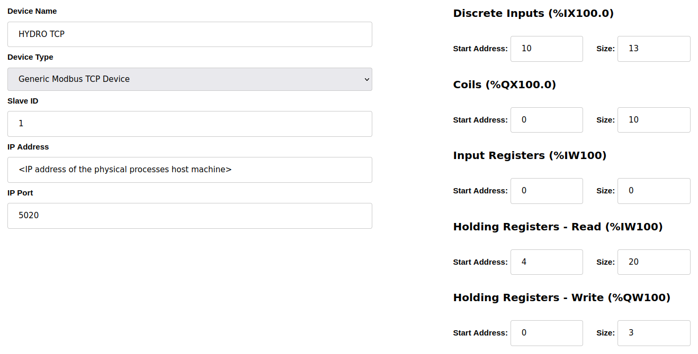

# Embedded Device Installation Guide

## Overview
This directory contains all software components related to the embedded device, including configuration files, build scripts, and installation procedures. The embedded device consists of an STM32MP1 board paired with a SenseHat, and is designed to replicate the functionality of both a Programmable Logic Controller (PLC) and an I-IoT Gateway.

The STM32MP1 runs a custom Linux operating system, built using Buildroot, and based on kernel version 6.1.141-rt52 with full preemption mode enabled. To emulate the behavior of a PLC and an I-IoT Gateway, various services are deployed on the STM32MP1. Below is a summary of the key components and their functionalities :

- **Sensor Manager:** a Python script that collects data from the SenseHat sensors (temperature, pressure and humidity), stores it in a Redis database and sends it to a Redis server.
- **Redis Server:** a Redis instance that acts as a data broker, sharing the collected sensor data with various components running on the STM32MP1, including the Sensor Webserver, LED Manager and MQTT Publisher.
- **Sensor Webserver:** a lightweight Python Flask web server that displays the latest sensor data from the SenseHat, and provides access to the data stored in the Redis database.
- **LED Manager:** a Python script that controls the SenseHat LED matrix, displaying the current temperature.
- **MQTT Publisher:** a Python script that formats and publishes sensor data to an external I-IoT server via the MQTT protocol.
- **OpenPLC:** an OpenPLC web server used to execute automation logic and control physical processes.
- **g++ Compiler:** a C++ compiler that enables OpenPLC to compile automation logic.


## Prerequisites
To build the custom Linux image and set up the system, the following tools and packages are required:
- **Docker:** Used to create a controlled environment for building the custom Linux image. You can install Docker by following the official installation guide: [Docker Installation Guide](https://docs.docker.com/engine/install/)
- **Required Packages:** The following packages must be installed on your development machine to ensure the script runs properly:
    - `linux-tools-common`
    - `linux-tools-<kernel_version>`
    - `pahole`
    - `sshpass`
    - `clang`
    - `llvm`

You can install the required packages using the following command:  
```bash
sudo apt install linux-tools-common linux-tools-$(uname -r) pahole sshpass clang llvm
```

## Building the Image
Once your development environment is set up, follow these steps to build the custom Linux image for the STM32MP1 board.

1. **Navigate to the embedded device directory:**  
```bash
cd embedded-device
```

2. **Modify the network configuration:** Edit the `network_configuration.sh` file to set up the network configuration for your testbed. This file contains environment variables that define the IP addresses of the embedded device and the I-IoT server.  

3. **Build the Linux image:** To create the custom Linux image, run the following command:  
```bash
sudo docker compose up
```
This command will start Docker and initiate the build process. The process may take around 4 hours to complete, depending on your machine performance. 

## Installation
Once the image build is complete, follow these steps to flash the image onto the STM32MP1 board and deploy the services required for the PLC and I-IoT Gateway to operate.

1. **Flash the image onto a microSD card:** 
After the build completes, you will have a bootable image file called `sdcard.img` located in the `embedded-device/buildroot/output/images/` directory. 
Flash this image onto a microSD card using the dd command: 
```bash
sudo dd if=./buildroot/output/images/sdcard.img of=/dev/<your_sdcard_device> bs=4MiB conv=fsync status=progress
```
> [!NOTE]
> Replace `<your_sdcard_device>` with the correct device identifier (e.g., /dev/sda). You can find it using the `lsblk` command.

2. **Insert the microSD card and power the STM32MP1:** 
Once the image is flashed, insert the microSD card into the STM32MP1 board. Power on the device and connect it to your network. After approximately 45 seconds, the SenseHat LED matrix should display the current temperature, confirming that the boot process was successful. Additionally, you should be able to ping the device using the IP address you assigned in the network configuration file.

3. **Run the final installation script:** 
To complete the setup, run the final installation script: 
```bash
./final_install.sh <device_ip_address> root root
```
This script will take approximately 15 minutes to complete, installing and configuring the final components needed to enable OpenPLC and the boopkit on the STM32MP1.

## Accessing the Services
Once the installation is complete, you should be able to access the following services via a web browser: 
- **Sensor Webserver:** http://<device_ip_address>:5000 
- **OpenPLC:** http://<device_ip_address>:8080

You can log in to the OpenPLC web server with the following default credentials: 
- **Username:** openplc
- **Password:** openplc

> [!NOTE]
> We recommend not changing these credentials so that the [developed attacks](../attacks/README.md) work without any changes.

## OpenPLC Configuration 

### Upload a PLC Program
1. Navigate to the "Programs" tab. 
2. Click on "Browse" and select your .st file (Structured Text file). For this project, we will use the `hydro_PLC_logic.st` file located in the `embedded-device/` directory. 
3. Once selected, click "Upload Program" and provide a name for the program.

The system will then automatically start the compilation of your program, which may take approximately one minute. When the compilation is complete, you should see the message "Compilation finished successfully".

### Create a Modbus Slave Device
1. Go to the "Slave Devices" tab. 
2. Click on "Add new device". 
3. Configure the device settings as shown in the image below:



4. Click on "Save device".

### Modify Settings
1. Navigate to the "Settings" tab to manage the servers used during program execution. 
2. Enable only the Modbus Server to ensure proper functioning.
3. Click on "Save Changes".

### Launch the PLC Program
1. Go to the "Dashboard" tab. 
2. Click on the "Start PLC" button (located in the sidebar).

> [!NOTE]
If the [physical process simulation](../servers/README.md#physical-process-simulation-and-scada-system-setup) is not running, you will see a "Connection failed" message in the logs, which is to be expected at this stage.

## SSH Access 
You can remotely access the STM32MP1 device via SSH using one of the two default user accounts:
- **Root user:**  
  - Username: `root`  
  - Password: `root`

- **Limited-privilege user:**  
  - Username: `techi`  
  - Password: `techi`

To connect via SSH, use the following command:
```bash
ssh <username>@<device_ip_address>
```

> [!NOTE]
> We recommend not changing these credentials so that the [developed attacks](../attacks/README.md) work without any changes.

## Next Steps
With the embedded device successfully set up, you can proceed with the installation of the server components for the testbed. For more information, refer to the [Servers Installation Guide](../servers/README.md).

## License
This module is part of the HENDRICS testbed and is subject to the same license terms.  
Please refer to the [LICENSE](../LICENSE) file located at the root of the repository.
