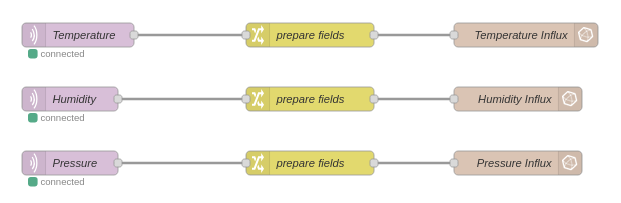

# Servers Installation Guide

## Overview
This directory provides all necessary files to deploy and run the I-IoT server, SCADA server, and physical process simulation. All components are containerized using Docker, which simplifies the deployment process. The following diagram illustrates the different Docker networks and the components they host.


## Prerequisites
Before running the servers and simulation, ensure that **Docker** is installed on your system. If Docker is not installed, follow the official installation guide: [Docker Installation Guide](https://docs.docker.com/engine/install/).

You also need the `make` utility. To install it, use the following command:
```bash
sudo apt install make
```

## I-IoT Server Setup

### Introduction
The I-IoT server allows you to visualize sensor data collected by the STM32MP1. It consists of the following key components:
- **MQTT Broker:** receives sensor data from the STM32MP1 and makes it available for processing.
- **Node-RED:** subscribes to the MQTT broker, formats the received data, and stores it in an InfluxDB instance.
- **InfluxDB:** stores the sensor data in a time-series database. 
- **Grafana:** provides a dashboard to visualize the sensor data stored in InfluxDB.

### Running the I-IoT Server
Follow these steps to set up and run the I-IoT server:

1. Build the Docker images:
```bash
   cd servers/node-red
   sudo chown 1000:1000 ./data
   sudo docker build . -t custom-node-red
```

2. Start the Docker containers:
```bash
   cd ..
   sudo docker compose up
```

After running these commands, you should be able to access the Node-RED, InfluxDB and Grafana interfaces via your web browser.

> [!NOTE] 
> You only need to build the Docker images the first time you run the I-IoT server.

### Accessing Node-RED
1. Open the Node-RED interface at: http://localhost:1882 
2. Ensure that the "Sensor_data_display" flow appears in the top bar. If it does not, import it manually: 
    - Click "Import" in the upper-right menu.
    - Import the `flows.json` file from the `servers/node-red/data` folder.

You should now see a flow similar to the one below:

 

This flow shows the three MQTT topics (humidity, temperature and pressure), each connected to an InfluxDB measurement.

### Accessing InfluxDB
1. Open the InfluxDB interface at: http://localhost:8088/signin  
2. Log in using the following credentials:
    - **Username:** adminadmin
    - **Password:** adminadmin
3. Once logged in, navigate to the "Data" section in the left menu, then go in the "Buckets" section and select the "sec" bucket to view the stored data. You can query the database from there.

### Accessing Grafana
1. Open the Grafana interface at: http://localhost:3002/ 
2. Log in using the following credentials:
    - **Username:** admin
    - **Password:** admin
3. From the left menu, go to "Dashboards" and select the "Sensor-data/Sensors Data Overview" dashboard. You should be able to see the sensor data collected from the SenseHat.

## Physical Process Simulation and SCADA System Setup

### Introduction
In this project, we simulate a hydroelectric power plant as the physical process. The physical process simulator consists of :
- **Python scripts:** simulate the behavior of a hydroelectric power plant.
- **Redis database:** stores the variables exchanged between the hydroelectric plant and the PLC, such as sensor values (e.g. water level, turbine RPM) and control variables (e.g. valve openings, circuit breakers).
- **Modbus client/server:** enables communication between the Redis database and the PLC.

For the SCADA system, we use FUXA, an open-source, web-based process visualization (SCADA/HMI/Dashboard) software. FUXA enables us to create custom SCADA systems for visualizing processes like our hydroelectric power plant simulation. Communication between the FUXA platform and the OpenPLC, running on the STM32MP1, is established via the ModbusTCP protocol.

### Running the Physical Process Simulator and FUXA
Follow these steps to run the physical process simulator and SCADA system:

1. Build the Docker images for the simulator:
```bash
    cd servers/process-simulator/dockerImages/amd64
    sudo make
```

2. Start the simulator and SCADA Docker containers:
```bash
    cd ../../
    sudo docker compose up
```

> [!NOTE]
> You only need to build the Docker images and create the simulator network the first time you run the simulator.

### Setting up FUXA

#### Loading the Process Visualization in FUXA
1. Open FUXA's interface at: http://localhost:1881/
2. Follow these steps to load the project:
    - Click on the three horizontal lines in the bottom-left corner to open the menu.
    - Navigate to the "Editor" tab.
    - In the editor, click the "Save Project" icon in the top-left corner and select "Open Project".
    - Locate the `final_hydro_FUXA.json` file in the `servers/fuxa/` folder and import it.
3. Connect the FUXA with the running OpenPLC on the STM32MP1: 
    - Go to "Change project" icon located next to the "Save Project" icon (Top-left corner) and then click on Connections.
    - Click on the pencil in the bottom-right corner of the STM32MP1's box. 
    - Edit the IP address and port corresponding to the OpenPLC of the STM32MP1 (defaut port is 502).
    - Enable the connection by activating the Enable button.

You should have a configuration screen similar to the one below:  
 

> [!NOTE] 
If the OpenPLC is not [running automation logic](../embedded-device/README.md#openplc-configuration), FUXA will not be able to establish a connection.

#### Viewing the Process Visualization
1. Click on the three horizontal lines in the bottom-left corner to open the menu.
2. Navigate to the "Home" tab to display the process visualization.
3. Click the "Run" button. If the physical process simulator is running and the OpenPLC is executing automation logic, the alternator should start producing electricity after a few seconds.


## License
This module is part of the HENDRICS testbed and is subject to the same license terms.  
Please refer to the [LICENSE](../LICENSE) file located at the root of the repository.
