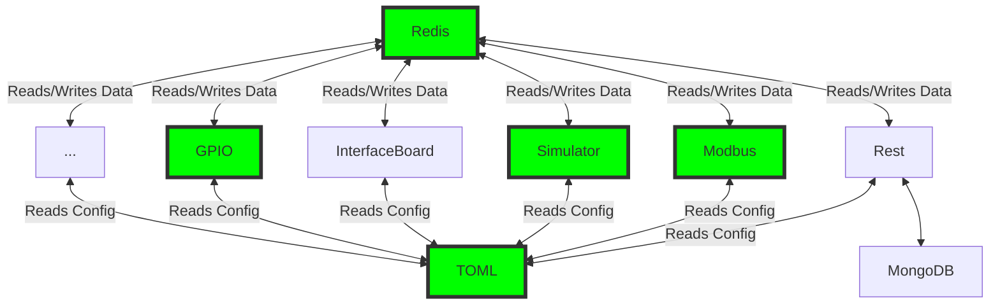

# Process Simulator Architecture

Process simulator aims to a modular architecture revolving on two common modules:

- A configuration file per scenario named ```config.toml```
- A Redis database

All modules (including the simulator itself) will read their config from the
```config.toml``` file and then read/write from the Redis database.
Specific care will need to be taken when designing variables since no
protection is offered against (e.g., make sure that a variable is an output of
Modbus and an input of the simulator but not an output of both Modbus and the
simulator).

Image bellow summarizes the architecture (gree modules are implemented).


